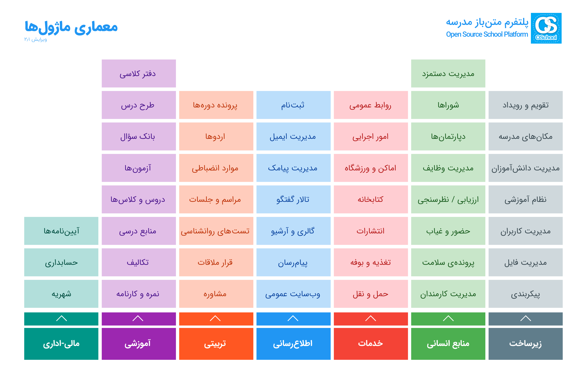

# OSchool

 

## About OSchool
OSchool is an open source platform for educational institutions and schools to manage all processes.

Our vision is to create a standard infrastructure for all educational institutions so that in the near future, better things will happen based on this platform.

## Module Architecture

## Contact Us
To contact us, please send an email to the following address:
World.OSchool@gmail.com
